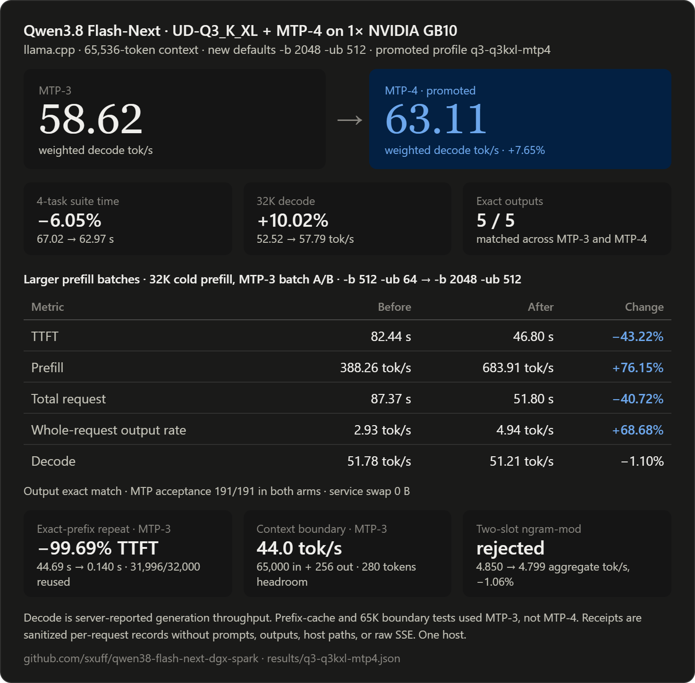

# Qwen3.8 Flash-Next on one DGX Spark or ASUS Ascent GX10

A pinned, checksum-verified llama.cpp recipe for `unsloth/Qwen3.8-Flash-Next-GGUF` on one NVIDIA GB10 system.

**Recommended operating point:** `UD-Q3_K_XL`, native MTP depth 4, one 65,536-token slot, `-b 2048 -ub 512`.

This repository contains scripts and measured results. It does not contain model weights.

## Latest measured result



The promoted profile is:

```text
q3-q3kxl-mtp4
-c 65536
-np 1
-b 2048
-ub 512
--spec-type draft-mtp
--spec-draft-n-max 4
--spec-draft-n-min 0
```

On the fixed four-task operator suite, MTP-4 improved weighted decode throughput from **58.62 to 63.11 tok/s**, a **7.65% increase**, and reduced suite wall time from **67.02 to 62.97 seconds**, a **6.05% reduction**, versus MTP-3. All five paired outputs, including the separate 32K row, matched exactly and every validator passed.

This is a controlled relative benchmark, not a claim that every workload decodes at 63.11 tok/s. The suite contains exact Python copy, exact JSON copy, a structured transform, and novel-code generation. The two copy fixtures account for 2,741 of 3,440 completion tokens, or 79.68% of the weighted total, and favor speculative-draft acceptance. The separate 32K row is a deterministic repeated-token microbenchmark that reached 100% MTP acceptance. On the less predictable novel-code row, MTP-4 reached 55.54 tok/s with 89.10% acceptance. Long-form creative prose was not part of the sealed suite.

The larger prefill configuration was also measured separately under MTP-3 on an exact 32,000-token cold prompt:

| Metric | `-b 512 -ub 64` | `-b 2048 -ub 512` | Change |
|---|---:|---:|---:|
| TTFT | 82.44 s | 46.80 s | 43.22% lower |
| Prefill | 388.26 tok/s | 683.91 tok/s | 76.15% higher |
| Total request | 87.37 s | 51.80 s | 40.72% lower |
| Whole-request completion rate | 2.93 tok/s | 4.94 tok/s | 68.68% higher |
| Decode | 51.78 tok/s | 51.21 tok/s | 1.10% lower |

Only `-b` and `-ub` changed. The generated output matched exactly, MTP acceptance remained 191/191, and service swap remained zero.

Full machine-readable values and qualifiers are in [`results/q3-q3kxl-mtp4.json`](results/q3-q3kxl-mtp4.json).

## Verified stack

- Hardware: one NVIDIA GB10 system with 128 GB unified memory
- Target: `unsloth/Qwen3.8-Flash-Next-GGUF`
- Quantization: `UD-Q3_K_XL`, 3 GGUF shards, 89,986,353,824 bytes
- Target revision: `8bdc666649440e9bdc97e16f3f75782c98478ff5`
- MTP sidecar: shared Q8_0, revision `38bb39ee97821de2c9009abb7e93950eec396e66`
- MTP sidecar SHA-256: `5ff54097406a905cf3a724c709124ceb0e3e10235ee862298969e91c96fa96e6`
- Native-vision projector: `mmproj-F16.gguf`, revision `824f539b2710e5a9e47af4952cf6578cf5ee8932`
- Projector SHA-256: `1f7b7f0b984cf065c604360c29c8098362ed61b290db0ff12c6f360bb1a8a980`
- Runtime: llama.cpp PR [#28243](https://github.com/ggml-org/llama.cpp/pull/28243), commit `d1a92352cbd417fd840b4e765c0b82f5fe3d1d89`
- CUDA target: SM121
- API: OpenAI-compatible llama.cpp server on `127.0.0.1:8001`

The model is licensed separately under the [Qwen Community License 1.0](https://huggingface.co/Qwen/Qwen3.8-Flash-Next/blob/f5d08274bafd880402bd16f5e3e6c514136ec06c/LICENSE). Review it before downloading or deploying the weights. The scripts in this repository are MIT licensed.

## 1. Preflight the host

Run this on the GB10 host, not inside a management container:

```bash
uname -m
nvidia-smi
docker run --rm --gpus all nvcr.io/nvidia/cuda:13.0.1-devel-ubuntu24.04 nvidia-smi
free -h
df -h "$HOME"
```

`uname -m` must report `aarch64`. Both GPU checks must pass. Keep at least 10 GiB free beyond the downloads and at least 6 GiB `MemAvailable` while serving.

Install build dependencies:

```bash
sudo apt-get update
sudo apt-get install -y git clang cmake ninja-build libcurl4-openssl-dev libssl-dev python3
```

## 2. Download and verify the exact artifacts

The downloader is resumable, pins each Hub revision, verifies every size and SHA-256, and requires a 10 GiB disk reserve.

Download the Q3 target:

```bash
export MODEL_ROOT="$HOME/models/Qwen3.8-Flash-Next-UD-Q3_K_XL-8bdc66664944"

python3 scripts/download_model.py \
  --manifest manifests/q3-q3kxl.json \
  --destination "$MODEL_ROOT"
```

Download the F16 projector into the same model root for native vision:

```bash
python3 scripts/download_model.py \
  --manifest manifests/q3-mmproj-f16.json \
  --destination "$MODEL_ROOT"
```

Download the shared Q8_0 MTP sidecar:

```bash
export MTP_ROOT="$HOME/models/Qwen3.8-Flash-Next-MTP-38bb39ee9782"

python3 scripts/download_model.py \
  --manifest manifests/q3-mtp-shared-q8.json \
  --destination "$MTP_ROOT"
```

For authenticated Hub access, export `HF_TOKEN` in the shell. Do not put tokens in command arguments or unit files.

To verify existing downloads without network writes, rerun each command with `--verify-only`.

## 3. Build the pinned MTP runtime

```bash
export LLAMA_ROOT="$HOME/src/llama.cpp-qwen38-flash-next-mtp"

JOBS=2 bash scripts/build_llama_mtp.sh "$LLAMA_ROOT"
```

The script fetches the exact MTP runtime commit, builds `llama-server` for SM121, and verifies that the binary enumerates the CUDA device.

## 4. Install the promoted MTP-4 profile

```bash
bash scripts/install_service.sh \
  "$MODEL_ROOT" \
  "$LLAMA_ROOT" \
  q3-q3kxl-mtp4 \
  "$MTP_ROOT/MTP/mtp-Qwen3.8-Flash-Next-shared-Q8_0.gguf" \
  "$MODEL_ROOT/mmproj-F16.gguf"

systemctl --user enable --now qwen38-flash-next-llama.service
```

The installer verifies the target, sidecar, and projector before writing the service environment. The service binds to localhost, disables service swap, caps its cgroup at 110 GiB, and launches with:

```text
-c 65536
-np 1
-b 2048
-ub 512
-ngl 99
-ot per_layer_token_embd=CPU
--no-kv-unified
--cache-prompt
--cache-reuse 0
--slot-prompt-similarity 0.10
--cache-ram 0
--no-cache-idle-slots
--no-context-shift
--load-mode mmap
--fit off
--spec-type draft-mtp
--spec-draft-n-max 4
--spec-draft-n-min 0
```

Follow startup without exposing the server publicly:

```bash
journalctl --user -u qwen38-flash-next-llama.service -f
```

## 5. Verify readiness and generation

A running process is not a ready model. Wait for model loading, then run a real request:

```bash
python3 scripts/smoke.py --base-url http://127.0.0.1:8001
```

The smoke script requires HTTP health and a nonempty completion.

## Additional measured behavior

### MTP-3 versus MTP-4

| Measurement | MTP-3 | MTP-4 | Change |
|---|---:|---:|---:|
| Four-task weighted decode | 58.62 tok/s | 63.11 tok/s | 7.65% higher |
| Four-task suite wall | 67.02 s | 62.97 s | 6.05% lower |
| 32K decode | 52.52 tok/s | 57.79 tok/s | 10.02% higher |
| 32K TTFT | 44.69 s | 44.78 s | effectively unchanged |

MTP-4 also reached 55.54 decode tok/s on the novel-code case with 89.10% draft acceptance. MTP-3 reached 52.32 tok/s on the same request.

### Exact-prefix reuse

A byte-identical 32K repeat under the MTP-3 control reused **31,996 of 32,000 tokens**:

- Uncached TTFT: 44.69 seconds
- Cached TTFT: 0.140 seconds
- Uncached request wall: 49.55 seconds
- Cached request wall: 5.01 seconds
- Output matched exactly

That is a **99.69% TTFT reduction** and an **89.88% request-wall reduction** for the exact repeated prefix. This cache row was not rerun under MTP-4.

### Practical context boundary

The MTP-3 control completed **65,000 input tokens plus 256 output tokens** inside the configured 65,536-token context:

- Occupied context: 65,256 / 65,536 tokens
- Remaining headroom: 280 tokens
- TTFT: 108.18 seconds
- Prefill: 600.95 tok/s
- Decode: 44.01 tok/s
- No truncation, context shift, OOM, or safety intervention

This verifies the 65K boundary for MTP-3 with the promoted batch settings. It was not rerun under MTP-4, so the repository does not claim an MTP-4 65K boundary measurement.

### Rejected two-slot profile

A separate `ngram-mod`, two-slot test produced real overlap but no aggregate gain:

- Serial aggregate whole-request completion rate: 4.850 tok/s
- Concurrent aggregate whole-request completion rate: 4.799 tok/s
- Change: 1.06% lower
- Maximum per-request wall ratio versus serial: 2.016x

The profile failed both promotion gates and is intentionally not included as an installer option. The first parent startup was nullified before any primary request when `nvidia-smi` blocked for more than 15 seconds during model loading. A sealed missing-cell amendment then collected only the four two-slot rows. No MTP, warm-cache, or context-boundary row was repeated.

During the valid amendment, minimum host `MemAvailable` was 50.31 GiB, maximum host swap growth was 230.54 MiB, and maximum service swap was zero.

## Retained alternatives

The installer still retains the earlier `q1-iq1s`, `q3-q3kxl`, and `q3-q3kxl-mtp3` profiles for reproduction and comparison. They are not the current recommendation. Their historical machine-readable measurements remain under [`results/`](results/), but the README no longer presents their old result tables as the current recipe.

## Earlier native-vision validation

The pinned F16 projector was hash-verified and exercised with two direct OpenAI-compatible API checks on the earlier non-MTP llama.cpp runtime commit `b8bdf73bb9baf044caadd33be2a51be70156ec57`:

- A generated 64×64 red square returned exactly `red`.
- A 2,108×972 screenshot returned the exact visible error banner.

That server advertised both `completion` and `multimodal` capabilities. Machine-readable evidence is in [`results/q3-q3kxl-vision.json`](results/q3-q3kxl-vision.json). The current installer preserves the verified projector and passes it to the MTP-4 runtime, but the latest MTP-4 optimization sweep did not repeat the image requests.

For a named Hermes provider, mark the served model as vision-capable only after `/v1/models` advertises `multimodal` and a real image request passes on the installed runtime.

## Prior art and scope

[`MiaAI-Lab/Qwen3.8-Flash-Next-Single-DGX-Spark`](https://github.com/MiaAI-Lab/Qwen3.8-Flash-Next-Single-DGX-Spark) established a single-Spark vLLM/NVFP4/PLE/MTP lane. [`Weschera/Qwen3.8-Flash-Next-1x-DGX-Spark`](https://github.com/Weschera/Qwen3.8-Flash-Next-1x-DGX-Spark) established a one-Spark llama.cpp MTP recipe with UD-Q4_K_XL and the shared Q8_0 sidecar. [Unsloth publishes the sidecar and MTP guidance](https://huggingface.co/unsloth/Qwen3.8-Flash-Next-GGUF/tree/38bb39ee97821de2c9009abb7e93950eec396e66/MTP).

This repository claims only the measured results for its pinned UD-Q3_K_XL target, runtime, prompts, and one-pass operator suite. It does not report repeated-run confidence intervals or claim that MTP-4 wins on every workload.

## Safety and troubleshooting

Before changing runtime flags, check:

```bash
systemctl --user status qwen38-flash-next-llama.service --no-pager
systemctl --user show qwen38-flash-next-llama.service \
  -p MemoryCurrent -p MemorySwapCurrent -p MemoryMax -p MemorySwapMax
awk '/MemAvailable|SwapTotal|SwapFree/ {print}' /proc/meminfo
nvidia-smi
```

Stop the owned service if `MemAvailable` drops below 6 GiB, service swap becomes nonzero, or host swap grows by more than 512 MiB from the pre-launch baseline. Do not kill unrelated workloads to make this model fit.

For the MTP-4 sweep, minimum host `MemAvailable` was 47.87 GiB, maximum host swap growth was 69.29 MiB, and maximum service swap was zero.

If startup fails, diagnose in this order: GPU visibility, exact shard verification, disk/cache, pinned binary and CUDA device list, service logs, health endpoint, then generation.

## Cleanup

```bash
systemctl --user disable --now qwen38-flash-next-llama.service
rm -f "$HOME/.config/systemd/user/qwen38-flash-next-llama.service"
systemctl --user daemon-reload
```

Cleanup intentionally leaves model weights and source trees untouched.
