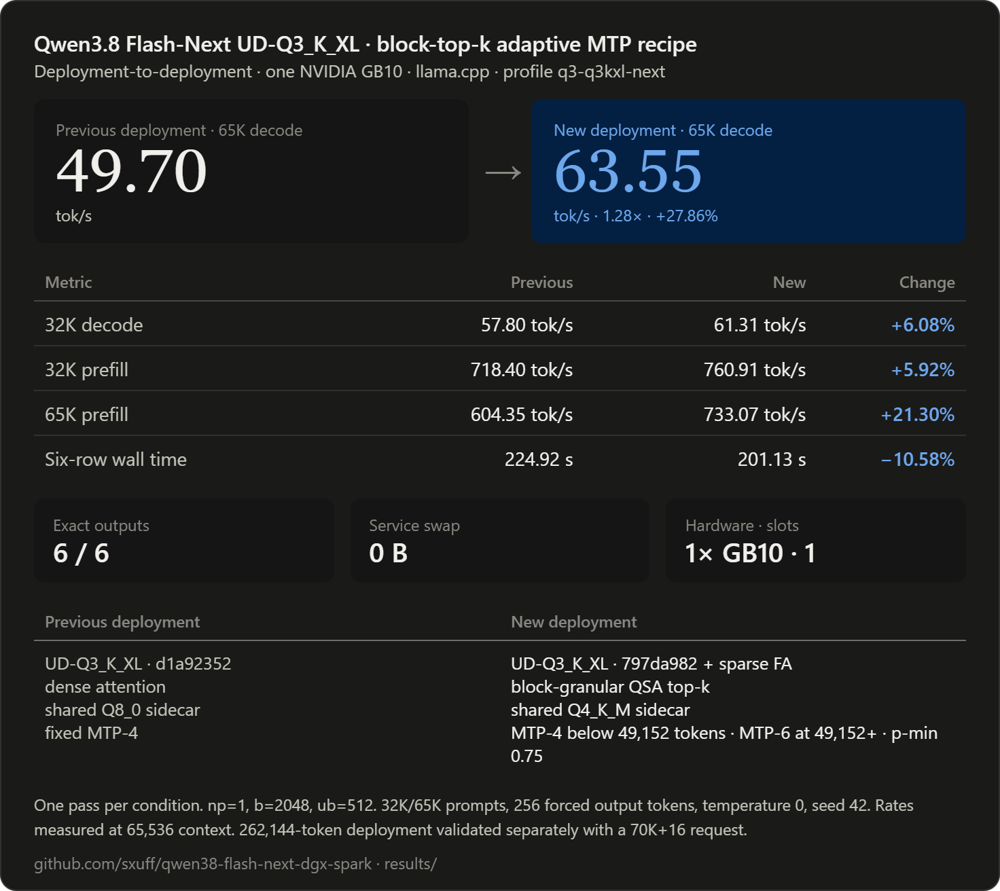

# Qwen3.8 Flash-Next on one DGX Spark or ASUS Ascent GX10

A pinned, checksum-verified llama.cpp recipe for `unsloth/Qwen3.8-Flash-Next-GGUF` on one NVIDIA GB10 system.

## Recommended architecture

```text
Target:        UD-Q3_K_XL
Runtime:       llama.cpp 797da982 + sparse FA
QSA selection: block-granular top-k
MTP sidecar:   shared Q4_K_M
MTP policy:    depth 4 below 49,152 active tokens
               depth 6 at or above 49,152 active tokens
p-min:         0.75
Deployment:    one 262,144-token slot
Batch/ubatch:  2,048 / 512
Vision:        F16 projector
```

This repository contains the build patches, artifact manifests, service scripts, and public-safe measured results. It does not contain model weights.

## Latest measured result



Against the previous `d1a92352` dense-attention, shared-Q8_0, fixed-MTP-4 deployment:

| Metric | Previous | New architecture | Change |
|---|---:|---:|---:|
| 32K decode | 57.80 tok/s | 61.31 tok/s | 6.08% higher |
| 65K decode | 49.70 tok/s | 63.55 tok/s | 27.86% higher |
| 32K prefill | 718.40 tok/s | 760.91 tok/s | 5.92% higher |
| 65K prefill | 604.35 tok/s | 733.07 tok/s | 21.30% higher |
| Six-row wall time | 224.92 s | 201.13 s | 10.58% lower |

All six outputs matched exactly. Every measured arm used one pass, one slot, temperature 0, seed 42, and fixed request bytes. Service swap remained zero.

This is a **deployment-to-deployment comparison**. Sparse FA, QSA selection, draft quantization, and speculative-depth policy changed together. The percentages must not be attributed to one component.

The context gate itself is workload-specific. Versus the immediately preceding block-top-k plus fixed-MTP-4 stack, it changed:

- 65K decode: `55.01 -> 63.55 tok/s`, **+15.51%**
- 32K decode: `62.15 -> 61.31 tok/s`, **-1.35%**
- Four-task suite decode: **-0.42%**
- Six-row wall time: **0.32% lower**

The adaptive profile is useful for deep contexts. Fixed MTP-4 remains the simpler general control.

Full machine-readable values and qualifiers are in [`results/q3-q3kxl-next.json`](results/q3-q3kxl-next.json).

## Verified stack

- Hardware: one NVIDIA GB10 system with 128 GB unified memory
- Target: `unsloth/Qwen3.8-Flash-Next-GGUF`
- Target quantization: `UD-Q3_K_XL`, 3 GGUF shards, 89,986,353,824 bytes
- Target revision: `8bdc666649440e9bdc97e16f3f75782c98478ff5`
- MTP sidecar: shared Q4_K_M, 1,907,151,936 bytes
- MTP revision: `38bb39ee97821de2c9009abb7e93950eec396e66`
- MTP SHA-256: `f521868a9e143718bef513772f6e04d9642551e362cf2439636d2abdbd149dfc`
- Projector: `mmproj-F16.gguf`, revision `824f539b2710e5a9e47af4952cf6578cf5ee8932`
- Projector SHA-256: `1f7b7f0b984cf065c604360c29c8098362ed61b290db0ff12c6f360bb1a8a980`
- Runtime base: `ggml-org/llama.cpp` commit `797da982b488254b11f844718c30e0c41f34d718`
- Block-top-k patch SHA-256: `1c8c953bae42a9b9765330b802a3d8ce38d0f15dd09b0f12242103010c152814`
- Context-gated MTP patch SHA-256: `68f6e9e3ea7999aabeabcc253dd78faa985a63f91299256a95bdda01945dada7`
- CUDA target: SM121
- API: OpenAI-compatible llama.cpp server bound to localhost

The model is licensed separately under the [Qwen Community License 1.0](https://huggingface.co/Qwen/Qwen3.8-Flash-Next/blob/f5d08274bafd880402bd16f5e3e6c514136ec06c/LICENSE). Review it before downloading or deploying the weights. The scripts and recipe patches in this repository are MIT licensed.

## 1. Preflight the host

Run this on the GB10 host, not inside a management container:

```bash
uname -m
nvidia-smi
docker run --rm --gpus all nvcr.io/nvidia/cuda:13.0.1-devel-ubuntu24.04 nvidia-smi
free -h
df -h "$HOME"
```

`uname -m` must report `aarch64`. Keep at least 10 GiB free beyond the downloads and at least 6 GiB `MemAvailable` while serving.

Install build dependencies:

```bash
sudo apt-get update
sudo apt-get install -y git clang cmake ninja-build libcurl4-openssl-dev libssl-dev python3
```

## 2. Download and verify the artifacts

The downloader is resumable, pins every Hub revision, verifies size and SHA-256, and requires a disk reserve.

```bash
export MODEL_ROOT="$HOME/models/Qwen3.8-Flash-Next-UD-Q3_K_XL-8bdc66664944"
export MTP_ROOT="$HOME/models/Qwen3.8-Flash-Next-MTP-38bb39ee9782"

python3 scripts/download_model.py \
  --manifest manifests/q3-q3kxl.json \
  --destination "$MODEL_ROOT"

python3 scripts/download_model.py \
  --manifest manifests/q3-mmproj-f16.json \
  --destination "$MODEL_ROOT"

python3 scripts/download_model.py \
  --manifest manifests/q3-mtp-shared-q4.json \
  --destination "$MTP_ROOT"
```

For authenticated Hub access, export `HF_TOKEN` in the shell. Do not put tokens in command arguments or unit files. Use `--verify-only` to verify existing artifacts without network writes.

## 3. Build the pinned runtime and patch set

```bash
export LLAMA_ROOT="$HOME/src/llama.cpp-qwen38-flash-next-next"
JOBS=2 bash scripts/build_llama_mtp.sh "$LLAMA_ROOT"
```

The build script:

1. fetches the exact base commit;
2. verifies both recipe-patch hashes;
3. applies block-granular QSA top-k;
4. applies the context-gated MTP-4/MTP-6 controller;
5. builds `llama-server` and `test-arg-parser` for SM121;
6. executes the parser/controller tests and CUDA device probe.

## 4. Install the new profile

```bash
bash scripts/install_service.sh \
  "$MODEL_ROOT" \
  "$LLAMA_ROOT" \
  q3-q3kxl-next \
  "$MTP_ROOT/MTP/mtp-Qwen3.8-Flash-Next-shared-Q4_K_M.gguf" \
  "$MODEL_ROOT/mmproj-F16.gguf"

systemctl --user enable --now qwen38-flash-next-llama.service
```

The installer verifies the target, Q4_K_M sidecar, and projector before writing the service environment. The service binds to localhost, disables service swap, and caps its cgroup at 110 GiB.

The promoted deployment flags are:

```text
-c 262144
-np 1
-b 2048
-ub 512
-ngl 99
-ot per_layer_token_embd=CPU
--no-kv-unified
--cache-prompt
--cache-reuse 0
--slot-prompt-similarity 0.10
--cache-ram 0
--no-cache-idle-slots
--no-context-shift
--load-mode mmap
--fit off
--spec-type draft-mtp
--spec-draft-n-max 6
--spec-draft-n-min 0
--spec-draft-p-min 0.75
--spec-draft-mtp-context-threshold 49152
```

## 5. Verify readiness and generation

```bash
journalctl --user -u qwen38-flash-next-llama.service -f
python3 scripts/smoke.py --base-url http://127.0.0.1:8001
```

A running process is not a ready model. Require model identity, real generation, advertised multimodal capability when the projector is installed, and zero service swap.

## Context and vision validation

The service allocates 262,144 tokens. A controlled promotion request completed:

- 70,000 prompt tokens
- 16 completion tokens
- 97.14 seconds wall time
- 40.85 GiB minimum `MemAvailable`
- 2.78 MiB maximum host-swap growth
- zero service swap

This proves operation above the previous 65K boundary. It is not a complete 256K stress test, and the throughput comparison above remains a 65K measurement.

The promoted runtime also completed a real screenshot request through its F16 projector:

- 4,040 prompt tokens including image tokens
- 57 completion tokens
- 13.35 seconds wall time
- HTTP 200
- zero service swap

A separate client can still time out if it sends tens of thousands of conversation-history tokens with the image. That is a client timeout and prompt-size issue, not evidence that the projector failed.

## Evidence boundaries

- One measured sweep per condition. No variance estimate.
- The 32K and 65K rows use deterministic synthetic long prompts and forced 256-token outputs.
- Absolute tok/s values are workload-scoped.
- The two copy-heavy operator fixtures favor speculative acceptance.
- Long-form creative prose is not represented by the headline rates.
- Raw prompts, outputs, SSE, host paths, credentials, and private deployment logs are intentionally excluded.

Historical MTP-3/MTP-4, n-gram, vision, and Q1 receipts remain under [`results/`](results/) for reproduction. They are not the current recommendation.

## Prior art

[`MiaAI-Lab/Qwen3.8-Flash-Next-Single-DGX-Spark`](https://github.com/MiaAI-Lab/Qwen3.8-Flash-Next-Single-DGX-Spark) established a single-Spark vLLM/NVFP4/PLE/MTP lane. [`Weschera/Qwen3.8-Flash-Next-1x-DGX-Spark`](https://github.com/Weschera/Qwen3.8-Flash-Next-1x-DGX-Spark) established a one-Spark llama.cpp MTP recipe with UD-Q4_K_XL and the shared Q8_0 sidecar. Unsloth publishes the target artifacts and shared MTP sidecars.

## Safety

Inspect the live service before and during long-context requests:

```bash
systemctl --user show qwen38-flash-next-llama.service \
  -p ActiveState -p MemoryCurrent -p MemorySwapCurrent -p MemoryMax -p MemorySwapMax
awk '/MemAvailable|SwapTotal|SwapFree/ {print}' /proc/meminfo
```

Stop the owned service if `MemAvailable` drops below 6 GiB, service swap becomes nonzero, or host swap grows by more than 512 MiB from the pre-launch baseline. Do not kill unrelated workloads to make this model fit.

## Cleanup

```bash
systemctl --user disable --now qwen38-flash-next-llama.service
rm -f "$HOME/.config/systemd/user/qwen38-flash-next-llama.service"
systemctl --user daemon-reload
```

Cleanup intentionally leaves model weights and source trees untouched.
