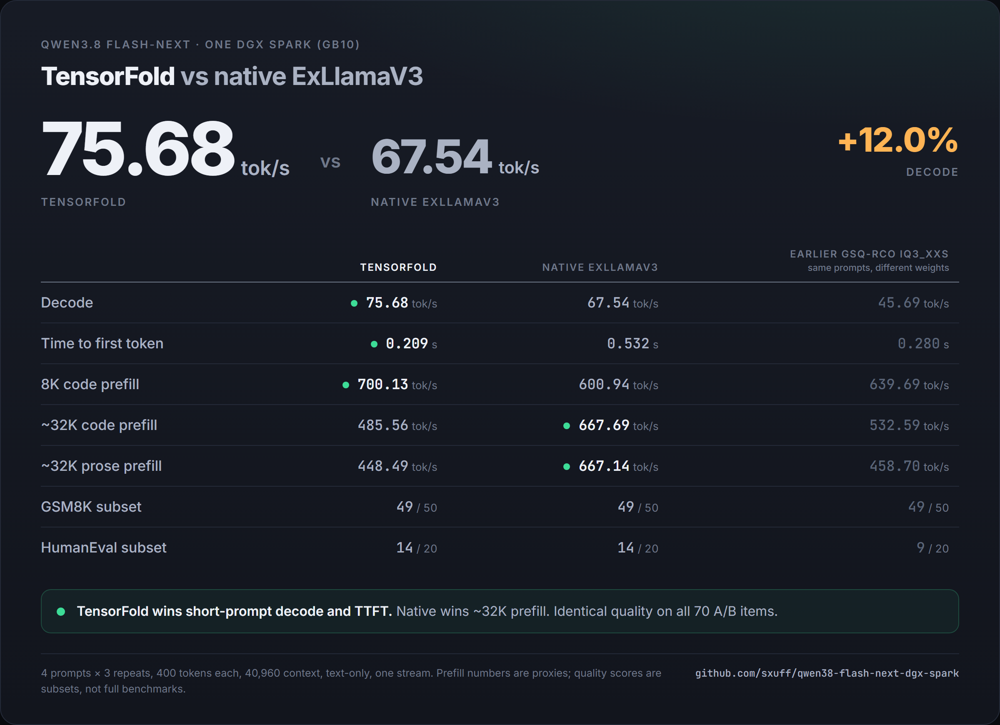

# Qwen3.8 Flash-Next on one DGX Spark or ASUS Ascent GX10

A **TensorFold EXL3 4.05** serving recipe for one NVIDIA GB10 with 128 GB unified memory. The default is **thinking enabled, 262,144-token context, native vision, image-aware prefix caching and MTP6**.



## The recipe

```text
Language weights: turboderp/Qwen3.8-Flash-Next-exl3
Quantization:     4.05bpw_h6_ng6
Runtime:          TensorFold 0.6.5, pinned source + vision-prefix patch
Hardware:         one GB10, 128 GB unified memory
Context:          262,144 tokens
MTP:              depth 6, confidence 0.70
KV cache:         BF16
Streams:          2, required for native vision
N-gram table:     demand-paged, prefetch=False
Lookup:           off
CUDA graphs:      on
Vision:           verified BF16 tower
Image history:    up to 64 images across the full message history
Prefix reuse:     unchanged complete processed-image history
API:              OpenAI-compatible, localhost:8001
Model ID:         qwen38-flash-next-tf405
Output default:   32,768 tokens, request-overridable
Thinking default: on, request-overridable
```

The language checkpoint includes its MTP head. No separate language drafter or language-loader patch is needed. The vision tower is a separate verified download; language weights remain unchanged.

## 1. Prepare the host

Use a GB10 host with working Docker GPU access, Python 3 and Git. The container includes its own Python 3.12, CUDA 13 development tools and pinned runtime dependencies.

```bash
git clone https://github.com/sxuff/qwen38-flash-next-dgx-spark.git
cd qwen38-flash-next-dgx-spark
uname -m
nvidia-smi
docker info
free -h
df -h "$HOME"
```

`uname -m` must report `aarch64`. Only one model-scale deployment should occupy the box. The serving launcher checks the preload headroom plan before starting and **does not stop other services** to make room. It keeps at least **7 GiB MemAvailable**, **20 GiB free disk**, **zero container swap**, and at most **1 GiB net host-swap growth** from launch. Stable pre-existing host swap is allowed; system swap settings are not changed.

## 2. Download and verify the weights

```bash
export MODEL_ROOT="$HOME/models/Qwen3.8-Flash-Next-EXL3-4.05"
export VISION_ROOT="$HOME/models/Qwen3.8-Flash-Next-BF16-vision"

python3 scripts/download_model.py \
  --manifest manifests/exl3-405.json \
  --destination "$MODEL_ROOT"

python3 scripts/download_model.py \
  --manifest manifests/vision-bf16.json \
  --destination "$VISION_ROOT"

export VISION_WEIGHTS="$VISION_ROOT/vision_tower_bf16.safetensors"
```

Both manifests pin immutable Hub revisions and file sizes. Large payloads use SHA-256; Git-stored metadata files use their Git-blob SHA-1. Downloads resume through temporary files, verify before promotion, and retain a 20 GiB disk reserve. `--verify-only` checks an existing download without writing it. Both artifacts are public; no Hub token is required.

- Language revision: `55a732e0c4c3d4614bc42b68493bb930d9b02c0a`
- TensorFold revision: `609ca419abecebdc5a059498a613680bd3aa847f`
- BF16 tower revision: `b5a234522364b10cdc4869844597bf77eeb942a7`
- BF16 tower SHA-256: `cdd69998e52e34badced49ef8ec09824b8b9a52e488094f0cadeadc7ebfc641e`

## 3. Build TensorFold

```bash
bash scripts/build_tensorfold.sh
```

The build uses an immutable ARM64 CUDA base, PyTorch **2.13.0+cu130**, Triton **3.7.1**, and the pinned TensorFold source. It verifies and applies [`patches/vision-prefix-cache.patch`](patches/vision-prefix-cache.patch) before installing the runtime; the patch is part of this recipe, not the unmodified upstream release. It installs no other inference engine. The command finishes with CPU-side patched-runtime and image-processor imports. CUDA extensions compile on the first model load, with `MAX_JOBS=1`; their cache is retained under `runtime-cache/`.

## 4. Start the server

Foreground:

```bash
bash scripts/run_server.sh "$MODEL_ROOT" "$VISION_WEIGHTS"
```

Or install the user service:

```bash
bash scripts/install_service.sh "$MODEL_ROOT" "$VISION_WEIGHTS"
systemctl --user enable --now qwen38-flash-next-tensorfold.service
journalctl --user -u qwen38-flash-next-tensorfold.service -f
```

The installer verifies both artifact manifests. It refuses to overwrite an existing unit and does not start a deployment implicitly. The Docker container is capped at **112 GiB**, with service swap disabled. The independent host supervisor checks the reserve and swap-growth guards throughout startup and serving. A healthy idle server has no idle timeout.

The endpoint is bound to **127.0.0.1:8001**. This recipe does not install an external proxy or publish an unauthenticated API to the network.

## 5. Verify thinking, text, native vision and prefix reuse

```bash
python3 scripts/smoke.py --base-url http://127.0.0.1:8001
python3 scripts/smoke_vision_cache.py --base-url http://127.0.0.1:8001
```

The smoke checks model identity, the advertised 262,144-token context, a completed response with nonempty `reasoning_content` and no thinking override, a real text response and a generated two-color image. The latter two checks explicitly disable thinking to isolate text and vision behavior. The image prompt does not name the colors. Passing this check establishes functional thinking, text and native image input, not full-window quality.

Run the cache smoke on an idle server. It requires a cold image request, a repeated-image hit with an identical answer, an appended-text hit, a changed-image miss followed by a hit, and a completed five-image history. Usage is read from `usage.prompt_tokens_details.cached_tokens`. Its short requests explicitly disable thinking to isolate cache behavior. The five-image check verifies that the old four-image admission cap is gone; it is not a 64-image capacity test.

### Image-history caching

The limit of **64 images counts the entire submitted message history**, not just the latest turn. Byte, pixel and visual-token safeguards still apply. Long coding sessions can replay earlier screenshots without hitting the old four-image cap.

The patch caches **language-model prefix state for unchanged complete processed-image history**. Text appended after the images can reuse it. The cache key includes image content, processed pixels, layout and rotary metadata, so identical placeholder tokens cannot reuse a different screenshot's state. Changed, resized, reordered or added images conservatively miss. Videos remain on the cold path. The image tower still encodes the images on each request.

Two concurrent requests can return correct answers even when only one hits: a busy retained source with no spare slot safely falls back to a cold prefill. Cache reuse is automatic server-side; no client cache switch is required. Clients must preserve the image content and prompt prefix to reuse them.

The deployed source patch passed **95 CPU tests, with 1 skipped**, plus live same-image, appended-text, changed-image, text-cache and concurrent-stream functional checks. Exact counts and answers are retained in [`results/vision-prefix-cache.json`](results/vision-prefix-cache.json). These checks do not change the benchmark figures below and do not establish full-window or exhaustive sparse-cache correctness.

Example request:

```bash
curl http://127.0.0.1:8001/v1/chat/completions \
  -H 'Content-Type: application/json' \
  -d '{"model":"qwen38-flash-next-tf405","messages":[{"role":"user","content":"Write a Python function that validates a UUID."}],"max_tokens":2048,"temperature":0,"stream":false}'
```

The output default is 32,768 tokens when a request omits its own cap. `max_tokens` or `max_completion_tokens` can override it; input plus generated tokens must fit the configured context. A client must also send images as native image content, not just a local file path.

**Thinking is enabled by default.** Chat responses return it in `reasoning_content`, separately from the answer in `content`; streamed responses use the corresponding delta fields. Reasoning and the answer share the output token budget. A client must support that field to display thinking traces. To disable thinking for an individual request, send `"chat_template_kwargs":{"enable_thinking":false}`. Requests that omit the switch retain thinking.

After pulling this update, rebuild with `bash scripts/build_tensorfold.sh` and restart an existing deployment at an idle boundary so the container uses both the patched runtime and the updated 64-image launcher. The image tag stays the same; a pull alone does not update an already-running container.

## Measured comparison

**TensorFold wins short-prompt decode and TTFT. Native ExLlamaV3 wins the approximately 32K prefill proxies.** All 70 selected A/B quality items have identical pass/fail outcomes.

| Metric | TensorFold EXL3 4.05 | Native ExLlamaV3 EXL3 4.05 |
|---|---:|---:|
| Short-prompt decode | 75.68 tok/s | 67.54 tok/s |
| TTFT | 0.209 s | 0.532 s |
| 8K code prefill proxy | 700.13 tok/s | 600.94 tok/s |
| ~32K code prefill proxy | 485.56 tok/s | 667.69 tok/s |
| ~32K prose prefill proxy | 448.49 tok/s | 667.14 tok/s |
| GSM8K subset | 49/50 | 49/50 |
| HumanEval subset | 14/20 | 14/20 |
| Peak whole-host unavailable memory | 77.37 GiB | 80.29 GiB |

The benchmark used **40,960-token context, text-only, one stream**. Both A/B arms used the same EXL3 language weights, but this is a **recipe-deployment comparison**, not an isolated runtime toggle: TensorFold used MTP6, confidence 0.70 and BF16 KV; the tested native ExLlamaV3 fork used dynamic MTP5, confidence 0.60 and 8-bit KV.

Speed is the equal-weight mean of four per-prompt medians, with three repetitions and 400 generated tokens per request. Decode is a post-first-emission proxy; TTFT includes prefill and the first sample. Prefill is a single-token request-wall proxy including EOS and overhead, **not isolated kernel throughput**. The approximately 32K fixtures contain 32,020 code and 32,196 prose tokens. Whole-host unavailable memory is `MemTotal - min(MemAvailable)` across loading and collection, not GPU allocated memory.

The quality scores cover 50 GSM8K and 20 HumanEval selected items, not full benchmark scores. TensorFold's same-load drafted-versus-serial check matched **400/400 token IDs on each of four prompts**, not A/B output equivalence. The supplied card's additional reference column is preserved with its provenance in the result receipt; it is not another install profile.

**The default 262K/native-vision deployment is separate from the 40K/text-only benchmark.** Image and text functional checks passed, but the displayed throughput is **not** a 262K or vision-enabled benchmark. No full-window stress result is claimed.

Exact values, runtime pins, retained evidence hashes and card checksum: [`results/tensorfold-exl3-405.json`](results/tensorfold-exl3-405.json).

### Known failure mechanisms on this stack (measured on a second GB10)

Three behaviors this runbook already works around have known root causes,
verified independently on another DGX Spark running the same PR #27742 build:

- **Do not force the per-layer embedding table onto the GPU.**
  `-ot per_layer_token_embd=CUDA0` looks tempting once you notice the ~25 GiB
  CPU buffer, but the tensor is IQ4_NL with `ne[0]=160` and the CUDA `get_rows`
  path requires `ne[0] % 256 == 0`. `--override-tensor` bypasses that support
  check, so instead of a clean error the kernel reads out of bounds — on
  unified memory this can starve the kernel itself: the host stops answering
  SSH and ping and needs a physical power cycle (there is no BMC on this
  hardware). The table's per-token cost is a small gather; there is nothing to
  gain by moving it.
- **Keep one slot while any `--spec-type` is active.** Two simultaneous
  decodes trip `GGML_ASSERT(mctx_idx->get_n_kv() == inp->mctx->get_attn()->get_n_kv())`
  (`src/models/qwen4exp.cpp`). The failure is shape-dependent: a concurrency
  hammer can pass at 2×32K contexts and the same test aborts at 2×131K, so a
  passing small-context check is not evidence of safety. Without speculation,
  multiple slots work.
- **Flat decode across quants is expected, not a measurement error.** Decode is
  dominated by a fixed per-token graph cost (thousands of nodes: MoE routing,
  QSA indexer, hyper-connections); the weight reads are the minority term.
  That is consistent with this repo's own numbers (Q3_K_XL 27.7 vs IQ1_S 26.6
  warm) and with UD-IQ4_XS measuring ~26–28 on another unit. Pick the largest
  quant that fits your memory plan; a smaller file buys no speed.

Longer write-ups of these mechanisms, a pinned Dockerfile stacking the MoE
vision fix (PR #27044 — required before sending images to any MoE GGUF; its
absence corrupts memory *probabilistically*), and a speculative-decoding
profile using Qwen3.5-0.8B as an external drafter (same 248,320-token vocab)
live in [paragontasx/qwen38-flash-next-dgx-spark](https://github.com/paragontasx/qwen38-flash-next-dgx-spark)
— complementary to this repo's manifests and multi-quant sweeps.

## Cleanup

```bash
systemctl --user disable --now qwen38-flash-next-tensorfold.service
rm -f "$HOME/.config/systemd/user/qwen38-flash-next-tensorfold.service"
systemctl --user daemon-reload
```

This stops only the recipe's owned container. Model files, the Docker image and compilation caches are retained.

## Licenses

The recipe scripts are MIT licensed. TensorFold is Apache-2.0 licensed. The model weights are separately governed by the [Qwen Community License 1.0](https://huggingface.co/Qwen/Qwen3.8-Flash-Next/blob/f5d08274bafd880402bd16f5e3e6c514136ec06c/LICENSE). Review the model license before downloading or deploying them.
